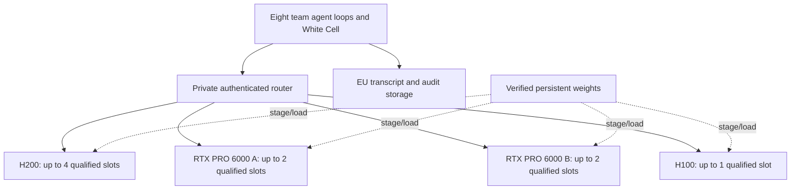

# AI adversary simulation platform — architecture

Status: selected target design; implementation and capacity qualification pending.
Reviewed: 2026-09-24. Decision: [ADR 0003](adr/0003-qwen38-gguf-fleet-serving.md).

This design replaces the Qwen3.5/FP8 and B200 recommendations previously in this
file. The exercise has eight Blue Teams, EU-resident inference on Verda in
Finland, and a fixed GPU fleet. There is **no monetary budget ceiling**.
The selected model is
`windowsxp811203/Qwen3.8-Flash-Next-Abliterated-GGUF`, using Q4_K_M with llama.cpp.

This review changes documentation and coding instructions only. Existing
Terraform, serving scripts, router configuration, and harness code still need
migration. [The implementation handoff](IMPLEMENTATION-HANDOFF.md) gives the next
coding LLM an ordered backlog and acceptance criteria; the
[deployment specification](MODEL-DEPLOYMENT-SPEC.md) defines the launch and test
contracts. Neither document is evidence that the new service is deployed.

## 1. Findings and decisions

| Review finding | Decision |
|---|---|
| The former B200 recommendation and €500 cost model violate current constraints | Use only the fleet below; prices are operational metadata |
| Existing defaults select Qwen3.5 and vLLM | Select the requested Qwen3.8 GGUF with llama.cpp; retain the recorded Qwen3.5 service for explicit rollback |
| The old 12 GiB KV estimate belongs to Qwen3.5 with FP8 cache | Recalculate for Qwen3.8 F16 attention/indexer caches and measure recurrent state and runtime allocations |
| The GGUF exceeds single H100/RTX VRAM | Start with the PLE embedding tensor on CPU and verify exact placement, RAM, and latency |
| A large primary plus a smaller-context standby cannot transparently serve eight full-context sessions | Use independently qualified replicas of the same artifact and context, with admission limits per replica |
| Nine provisional slots do not provide eight-session resilience to every host loss | Report remaining capacity, queue or pause excess work, and preserve history |
| Runtime defaults expose 16/10 slots, `live4` exposes 12, and team keys allow three requests each | Replace these independently configured limits with qualification-backed admission and serving limits |
| The fleet guard counts the selected Terraform roles | Preserve it and also reconcile held, unmanaged, and replacement instances before any acquisition |

## 2. Binding hardware and workload constraints

| Resource | Allowed SKU | Maximum fleet allocation | Nominal VRAM | Provisional session ceiling |
|---|---|---:|---:|---:|
| H200 | `1H200.141S.44V` | 1 GPU | 141 GB | 4 |
| H100 | `1H100.80S.30V` | 1 GPU | 80 GB | 1 |
| RTX PRO 6000 | `1RTXPRO6000.30V` twice, or `2RTXPRO6000.60V` once | 2 GPUs | 96 GB each | 2 per GPU, 4 total |
| **Fleet** | All allowed allocations combined | **4 GPUs** | **413 GB aggregate, not pooled** | **9 provisional** |

No B200, B300, GB300, A100, L40S, other GPU family, or larger/count-exceeding
SKU is permitted. The hardware cap applies at all times, including experiments,
rollback services, other Terraform states, and replacement overlap. Two separate
single-GPU RTX nodes **are allowed**; two dual-GPU RTX nodes are not.
`local.fleet_limit` in [infra/locals.tf](../infra/locals.tf) is the implemented
source for GPU counts, enforced for planned roles by `terraform_data.fleet_guard`.

> **Allow-list relaxation considered and rejected ([ADR 0004](adr/0004-relax-allowlist-b200-primary.md)).**
> The 111 GiB Q4_K_M weights fit on-GPU only on the H200 under the cap above; the
> H100/RTX replicas depend on CPU-PLE offload and are marginal (§4). Adding a
> larger primary (B200) was weighed and **rejected on cost**, so the cap above
> stands and B200 remains `family = "blocked"`. The model is served on the existing
> fleet — H200 on-GPU, H100/RTX via offload, qualified per node. No fleet change.

A full session reserves **131,072 tokens: 129,024 input + 2,048 output**, with
reasoning included in output. Input includes system instructions, tool schemas,
history, and template delimiters. This is the full-context qualification target.
A 64k service is a separate, explicitly selected workload, never an automatic
fallback for a 128k conversation. No silent truncation or context shifting.

The session figures above are conservative planning ceilings, **not measured
capacity**. Begin qualification at one slot. Normal admission on replica `r` is
`min(policy_ceiling[r], qualified_sessions[r])`; absent or stale qualification
means no normal traffic. Larger trials require an explicit revision of the
session policy and then evidence before rollout. The current coding scope does
not authorize exceeding 4/1/2 per GPU or increasing the hardware cap.

Eight simultaneous team generations are the target. A White Cell generation
also consumes a slot; it is not free overhead. If the measured fleet provides
fewer than eight comfortable slots, report that the target is unmet and use an
explicit queued/reduced-concurrency exercise mode. Do not add GPUs to make it fit.

## 3. Selected model and runtime

Use this identity, not a similarly named community conversion:

| Field | Value |
|---|---|
| Repository | `windowsxp811203/Qwen3.8-Flash-Next-Abliterated-GGUF` |
| Revision | `c3365c410baa29bdd3d7cc8cbc2bf9bee0de2f3a` |
| File | `Qwen3.8-Flash-Next-Abliterated-Q4_K_M.gguf` |
| Bytes | `119150722112` (119.15 GB / about 110.97 GiB) |
| SHA-256 | `324c85132e04654480ac93923f444b760b2950eb8c84a346dd0ec70e680ecde2` |
| Engine | llama.cpp CUDA, immutable compatible commit and image digest to be qualified |

The [publisher's metadata](https://huggingface.co/api/models/windowsxp811203/Qwen3.8-Flash-Next-Abliterated-GGUF/revision/c3365c410baa29bdd3d7cc8cbc2bf9bee0de2f3a?blobs=true)
confirms the revision, size, and hash. The
[model card](https://huggingface.co/windowsxp811203/Qwen3.8-Flash-Next-Abliterated-GGUF)
records repaired sparse-attention metadata and only limited GGUF functional
checks. Verify the hash and compression metadata before loading; do not treat
parent-model benchmarks or refusal claims as qualification of this GGUF.

Upstream [llama.cpp PR #27742](https://github.com/ggml-org/llama.cpp/pull/27742)
is merged. The publisher's older open-PR-only runtime instructions are stale.
Nevertheless, compatibility of this pre-merge conversion with the chosen runtime
must be demonstrated. A successful build or upstream architecture support alone
does not establish that this file loads correctly. Do not use a moving PR head,
`master`, or `latest` as a deployment pin.

The initial profile is text-only, no draft model, F16 caches, transformer layers
on GPU, and `per_layer_token_embd` on CPU. Keep the checkpoint's tokenizer and
chat template together. Tool-call parsing, reasoning replay, and long-context
retrieval must be evaluated on the exact quantization/runtime combination.

The license is [Qwen Community License 1.0](https://huggingface.co/Qwen/Qwen3.8-Flash-Next/blob/main/LICENSE),
not Apache 2.0. Preserve it with the artifact. Its separate-license provisions
for Model-as-a-Service/AI Work Assistant businesses and its internal-use exception
need assessment against the actual organiser and participant arrangement before
participant service. Selecting the model does not establish license clearance.
This does not prevent completing the documentation or local implementation.

## 4. Memory and capacity reasoning

All resource checks use bytes and report both decimal GB and binary GiB.
Download size, GPU-resident weights, and CPU-resident weights are different
quantities. Host RAM is part of the deployment requirement; the SKU suffix does
not establish its capacity.

From the [base configuration](https://huggingface.co/Qwen/Qwen3.8-Flash-Next/blob/main/config.json),
ordinary full-attention F16 KV at 131,072 tokens is:

```text
12 layers × 2 (K,V) × 2 KV heads × 256 dimensions × 2 bytes × 131072
= 3 GiB per slot
```

The [inspected indexer cache implementation](https://raw.githubusercontent.com/ggml-org/llama.cpp/master/src/llama-memory-hybrid-idx.cpp)
adds approximately 0.375 GiB per slot for 12 layers of 128-dimensional F16 keys.
This is a derivation, not a measured allocation: confirm it against the pinned
runtime and GGUF. Recurrent state, checkpoints, prefill workspace, alignment, and
allocator overhead are additional. Sparse attention is not permission to assume
that ordinary KV storage disappears.

Thus eight slots need approximately **27 GiB of attention plus indexer caches**
across replicas before those additions. Each independent replica also holds its
own model weights. The fleet's aggregate VRAM cannot be used as one memory pool.

The deployment spec retains an illustrative 60–65 GiB GPU-weight split after CPU
PLE placement, 4–6 GiB incremental memory per slot, and a runtime/free-memory
reserve. Those assumptions do not prove fit. The H100 may fail even one session;
RTX may fail two; H200 may fail four through latency before running out of memory.
Inspect tensors and loader logs, measure CPU/GPU peaks under concurrent prefill,
and require at least 10% GPU memory free at measured peak with no sustained swap.

Host-memory planning starts at 128 GiB, preferably 192–256 GiB, with at least
80 GiB available before CPU-PLE trials. These are checks against the allowed
SKU's actual resources, not permission to buy a larger SKU. If insufficient,
mark the profile infeasible. Disk must hold the verified GGUF, runtime/build
files, rollback artifacts, and temporary staging space without replacing the
protected weights volume.

## 5. Target topology and routing

Prefer four independent single-GPU replicas, reusing held nodes where possible.
All serve the same pinned Q4_K_M artifact at the same context contract; hardware
speed and measured admission capacity may differ.



A held dual-RTX machine can instead run two GPU-isolated, independently limited
processes. It consumes both RTX allowances and creates one shared host failure
domain. Validate aggregate CPU RAM, bandwidth, and storage contention with both
processes running; single-process measurements do not qualify the pair. Do not
assume tensor parallelism or 192 GB pooled VRAM is required or equivalent.

Routing requirements:

- Stable session-to-replica affinity for cache reuse; capacity-aware placement of
  new sessions. Same model/context does not imply equal hardware performance.
- Per-team limit initially one active generation, plus per-replica and fleet
  admission limits. White Cell uses the same admission pool. Queued work is not
  counted as active full-context capacity; bounded waits and queue delay are
  visible in metrics and errors.
- Public aliases follow `redcell-<model>`: `redcell-qwen38` for the selected
  service, `redcell-qwen35` for the explicit Qwen3.5 rollback. The legacy
  `redcell-adversary` alias is retired and must not be reused. Validate llama.cpp OpenAI-compatible API integration
  with the pinned LiteLLM version. A global/per-key `max_parallel_requests`
  setting alone is not a per-backend capacity guarantee.
- Retry only within eligible capacity. Retain complete transcripts outside the
  inference process and re-prefill them on recovery. KV/recurrent state does not
  migrate automatically; recovery latency must be measured with cold context.
- Do not replay a completed tool action because an inference request was retried.
  Do not combine partial completions from different attempts. Preserve request,
  turn, and tool-call identifiers in the audit trail.

### Failure capacity at the provisional ceilings

| Failure | Remaining slots | Consequence for eight active teams |
|---|---:|---|
| None | 9 | Eight teams plus at most one spare/White Cell generation |
| H100 | 8 | No spare generation slot |
| One single-GPU RTX host | 7 | Queue/pause at least one team generation |
| H200 | 5 | Queue/pause at least three team generations |
| Dual-RTX host, if used | 5 | Both RTX replicas lost together |

These are ceiling arithmetic, not availability promises. Substitute measured
limits in rehearsal. The proposed fleet has no full eight-team N+1 guarantee.
A shared volume, router, or control-network outage can affect every replica; GPU
family diversity does not remove those common dependencies. A 10–15 minute
recovery objective is an exercise planning target, not a measured SLA.

## 6. Acquisition, storage, and service lifecycle

Read the [capacity runbook](CAPACITY-RUNBOOK.md) before topology work. Acquire
allowed capacity early and retain it across development, qualification,
rehearsal, and live play. Use on-demand nodes for the live fleet. Model changes
must not release GPU capacity or replace protected volumes.

Terraform owns machine identity, placement, network access, keys, and persistent
storage. A separate deployment manifest owns the model, runtime, launch flags,
and qualified slots. Changes to the latter require drain/stage/activate/rollback,
not a new GPU instance. Existing startup templates couple those concerns and
must be migrated without recreating held nodes.

Current `NVMe_Shared` storage is mounted through NFS by the startup script; it is
not local NVMe on every GPU host. Confirm same-site attachment requirements and
measure concurrent loads and CPU-PLE page residency. A node in another Finnish
site requires a deliberate storage/copy plan. Stage immutable artifacts once,
verify each usable copy, and retain rollback data. Avoid concurrent writes to a
shared model cache. Resizing the current protected volume can replace it.

Secrets stay in the established root-owned mode-0600 node environment file,
provisioned over SSH. Never put them in Terraform, generated argv, manifests,
reports, logs, or Git. Keep test listeners on localhost behind SSH tunnels and
normal endpoints private and authenticated. Prompts, outputs, and audit data
remain in the EU; no external inference fallback is part of this design.

## 7. Qualification and release gates

The [deployment spec](MODEL-DEPLOYMENT-SPEC.md) supplies the full procedure.
`evals/model_capacity.py` and portable deployment profiles are **planned files**.
The existing two-slot client and sequential bake-off runner do not establish
comfortable fleet capacity.

Qualify each exact artifact/runtime/hardware/workload profile from N=1 up to its
policy ceiling, then rehearse the combined fleet. Required proposed SLOs include:

| Measure | Acceptance target |
|---|---|
| Full-context generation | At least 10 tokens/s for at least 95% of turns, per session |
| Warm follow-up TTFT | p95 at most 10 seconds including admission delay |
| Cold 129,024-token input TTFT | p95 at most 180 seconds |
| Correctness | Retrieval, isolation, continuity, and structured stub arguments pass |
| Reliability | No OOM, crash, failed request, or silent context reduction |
| Margin | At least 10% free GPU memory at measured peak; no sustained swapping |

Use concurrent independent cold prefixes, growing follow-ups, and mixed warm/cold
arrivals. Include at least 100 measured turns, 20 cold full-context requests, and
30 minutes per candidate; repeat the highest passing candidate after restart.
If the ceiling passes, report it as a tested bound under policy, not the model's
physical maximum. Record failures and zero-capacity results honestly.

Rehearsal must demonstrate eight simultaneous resident conversations if claiming
the eight-team target, per-replica admission, transcript recovery after host loss,
and explicit queued behavior when capacity drops. No memory-only estimate or
short arithmetic smoke test can approve the release.

## 8. Scope, audit, and handoff

The harness remains orchestration for an authorised exercise. Nonempty
`in_scope_networks` is mandatory; role, scope, and authorisation stay in the
system prompt. Per-turn inputs stay free of repeated authorisation boilerplate.
Tools remain range-bound stubs, and recon stubs never invent observations. The
abliterated model does not replace scope validation or tool argument validation.

Preserve team-attributable transcripts, usage, tool requests/results, timestamps,
and model/runtime/profile identifiers for after-action review. Access control and
retention belong to the EU exercise environment. The router database and audit
storage must be deliberately operated; configuration comments do not establish
that they exist or contain complete logs.

Implementation is delegated to a future coding LLM through
[AGENTS.md](../AGENTS.md) and [IMPLEMENTATION-HANDOFF.md](IMPLEMENTATION-HANDOFF.md).
Historical decisions remain in ADRs 0001/0002 with supersession notices. Existing
Qwen3.5 smoke-test evidence remains valid for that recorded configuration only.
